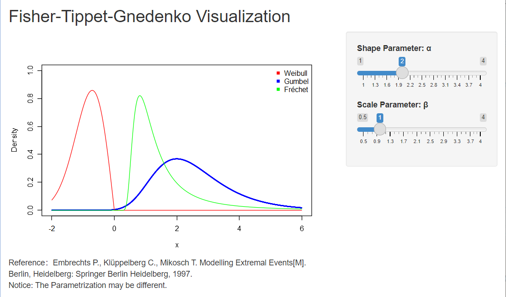
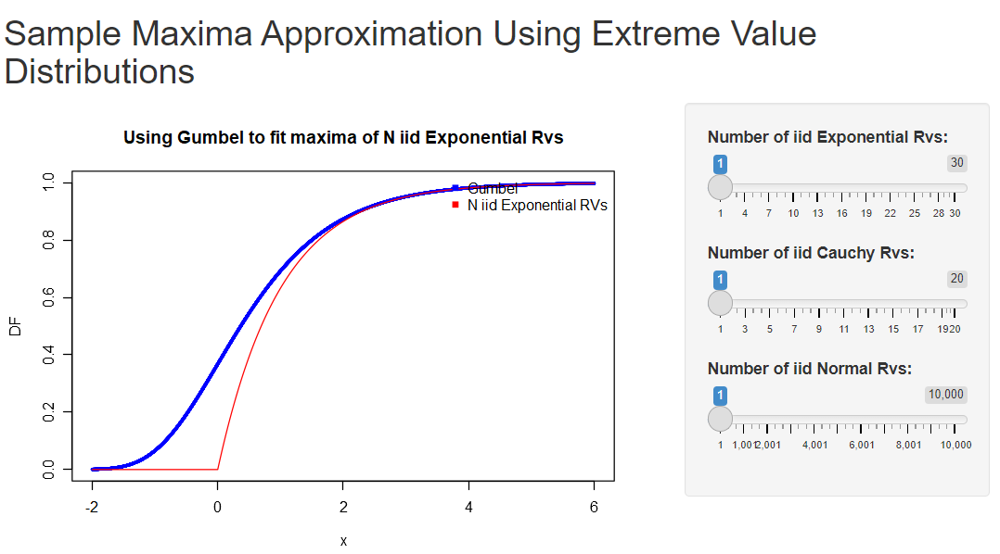
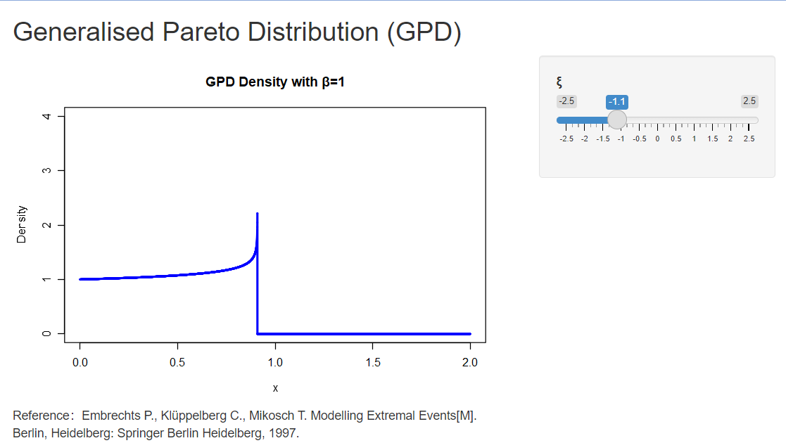

## “CLT in non-Gaussian World”

**Slides （Updated on May 7th）:** [[Download](https://yuanzhuang.xyz/uploads/EVT/Slide_Chap3_Yuan_Zhuang.pdf)]

**Handouts （Updated on May 7th）:** [[Download](https://yuanzhuang.xyz/uploads/EVT/Appendix_Chap3_Yuan_Zhuang.pdf)]

**R Codes （Updated on May 7th）:** [[Download](https://yuanzhuang.xyz/uploads/EVT/EVT_Chap_3.Rmd)]

**R Shiny：**

(1)Visualization of Fisher-Tippet-Gnedenko Theorem [[Download](https://yuanzhuang.xyz/uploads/EVT/FTG.zip)], or run the following code in R:

```r
library(shiny)
runUrl("https://yuanzhuang.xyz/uploads/EVT/FTG.zip")
```




(2)Sample Maxima Approximation using EVT [[Download](https://yuanzhuang.xyz/uploads/EVT/FTGApproximation.zip)], or run the following code in R:

```r
library(shiny)
runUrl("https://yuanzhuang.xyz/uploads/EVT/FTGApproximation.zip")
```



(3)GPD Visulization [[Download](https://yuanzhuang.xyz/uploads/EVT/GPD.zip)], or run the following code in R:

```r
library(shiny)
runUrl("https://yuanzhuang.xyz/uploads/EVT/GPD.zip")
```

