死亡率的预测一直是保险精算行业非常关注的事情。在前面的课中我们已经学习了如何使用Lee-Carter、CBD和二维P样条进行死亡率的拟合，但如何使用这些模型对未来的死亡率进行预测呢？下面我将分别使用之前学过的模型进行死亡率的预测。


```r
library(gnm) # 做Lee-Carter的相关包
library(astsa) # 时间序列分析的相关包
library(svcm)
library(MortalitySmooth) # 死亡率修匀的关键包
```

# 1. 数据准备

这一次需要用到的数据是1961-2013年，英国50-90岁男性的数据。数据来自HMD（Human
Mortality
Database）。数据已经下载到本地了，是个txt文件。首先，我们定义一下`Read.HMD`这个函数，它可以自动读取我们下载来的txt文件。代码在下一面，我参考了*Modelling
Mortality with Actuarial Applications*这本书。


```r
check.integer <- function(x) {
    x == round(x)
}
Read.HMD <- function(file){
  x <- scan(file, skip = 3, what = "character") 
  x <- matrix(x, ncol = 5, byrow = T)
  #   删除110岁以上的数据
  Select <- rep(1, nrow(x))
  Select[check.integer((1:nrow(x))/111)] <- 0
  x <- x[Select == 1, ]
  x <- matrix(as.numeric(c(x)), ncol = 5)
  #   把年份找出来，分成男女
  Age <- 0:109
  Year <- min(x[ ,1]) : max(x[ ,1])
  Female <- x[ ,3]
  Female.Matrix <- matrix(Female, nrow = 110)
  dimnames(Female.Matrix) <- list(Age, Year)
  Male <- x[ ,4]
  Male.Matrix <- matrix(Male, nrow = 110)
  dimnames(Male.Matrix) <- list(Age, Year)
  return(list(Age = Age, Year = Year, Female.Matrix = Female.Matrix,
              Male.Matrix = Male.Matrix))
}
```

我们利用刚才编写的函数，把数据读进来，找到想要的年份和年龄后，计算一些常用的变量：


```r
Death.Data <-  Read.HMD("C:\\Users\\lenovo\\Desktop\\lt\\leecarter\\Lee-Carter Application\\HMD_UK_Deaths_2013.txt")
Exposure.Data = Read.HMD("C:\\Users\\lenovo\\Desktop\\lt\\leecarter\\Lee-Carter Application\\HMD_UK_Exposures_2013.txt")
# 年龄和年份，一个是所有年龄，一个是目标年龄
Age <-  Death.Data$Age
Year <-  Death.Data$Year
AGE <-  50:90
YEAR <-  1961:2013
# 1961-2013年，英国50-90岁男性
Dth <-  Death.Data$Male.Matrix[(49 < Age) & (Age < 91),
(1960 < Year) & (Year < 2014)]
Exp <-  Exposure.Data$Male.Matrix[(49 < Age) & (Age < 91),
(1960 < Year) & (Year < 2014)]
# Obs是中心死亡率取对数
Obs <-  log(Dth/Exp)
# 取得死亡率矩阵的维度
n.x <-  nrow(Dth)
n.y <-  ncol(Dth)
```

# 2. 使用时间序列方法做Lee-Carter模型的预测

## 2.1 参数估计

Lee-Carter模型同时对年龄和时间这两个影响死亡率的因素进行建模，相关假设如下：

$$\log \left(\mu_{x+1 / 2, y+1 / 2}\right)=\alpha_x+\beta_x \kappa_y, x=x_1, \ldots, x_{n_x}, y=y_1, \ldots, y_{n_y}$$

这里，$x$表示的是不同的年龄，$y$表示的是不同的年份。想要预测未来年份的死亡率，只需要预测$\kappa_y$即可，因为$\alpha_x$和$\beta_x$只跟年龄有关，跟年份无关。

不管怎么说，让我们先使用`gnm()`，用极大似然法拟合一个模型：


```r
# 把年龄和年份重复很多遍，直到行数为nx*ny，方便做交叉项
Age.F <-  factor(rep(AGE, n.y))          
Year.F <-  factor(rep(YEAR, each = n.x)) 
Dth.V <-  c(Dth)   #  把矩阵压成一个向量
# 这种向量是另一种展示面板数据的方式，有点像Stata里面的方式
# 相同年份的聚成一堆，一个年份中按照年龄来排序
Exp.V <-  c(Exp)
# 最重要的函数是Mult，制作了交叉项
# 回归没有截距，通过年龄确定唯一的alpha，通过年龄和年份确定唯一的交叉项
# 使用泊松分布的典则连接，offset项是暴露数，加了log
LC.Male <-  gnm(Dth.V ~ -1 + Age.F + Mult(Age.F, Year.F),
                offset = log(Exp.V), family = poisson)
```

```
## Initialising
## Running start-up iterations..
## Running main iterations......
## Done
```

但是，上一面得出来的参数并不满足Lee和Carter原文中的约束：

$$\sum \beta_x=1 ; \sum \kappa_y=0$$

所以，在这里需要对这些参数做一下变换：

$$\begin{aligned} \hat{\boldsymbol{\alpha}} & =\hat{\boldsymbol{\alpha}}_R+\bar{\kappa}_R \hat{\boldsymbol{\beta}}_R \\ \hat{\boldsymbol{\kappa}} & =n_x \bar{\beta}_R\left(\hat{\boldsymbol{\kappa}}_R-\bar{\kappa}_R \mathbf{1}_{n_y}\right) \\ \hat{\boldsymbol{\beta}} & =\hat{\boldsymbol{\beta}}_R /\left(n_x \bar{\beta}_R\right)\end{aligned}$$


```r
# 得到参数
Alpha.gnm <-  LC.Male$coef[1:n.x]
Beta.gnm <-  LC.Male$coef[(n.x+1):(2*n.x)]
Kappa.gnm <-  LC.Male$coef[(2*n.x+1):(2*n.x+n.y)]
# 首先求一下均值
Kappa.m <-  mean(Kappa.gnm)
Beta.m <-  mean(Beta.gnm)
# 进行转换
Alpha.hat <-  Alpha.gnm + Kappa.m*Beta.gnm
Beta.hat <-  Beta.gnm/(n.x * Beta.m)
# kappa中的那个示性函数只是为了把均值（1*1）转成一个向量
Kappa.hat <-  n.x * Beta.m*(Kappa.gnm - Kappa.m)
# 得到最后的预测值
Fitted.M.hat <-  Alpha.hat + Beta.hat %*% t(Kappa.hat)
```

现在我们已经记录好了参数，接下来就是看怎么对$\kappa_y$进行预测。

## 2.2 时间序列分析

一个对$\kappa_y$的最简单假设是：

$$
\kappa_y=\mu+\kappa_{y-1}+\epsilon_y, y=2, \ldots, n_y
$$

这是一个带漂移项的随机游走过程。为何要这么假设？可以看看我们估计出的$\kappa_y$：

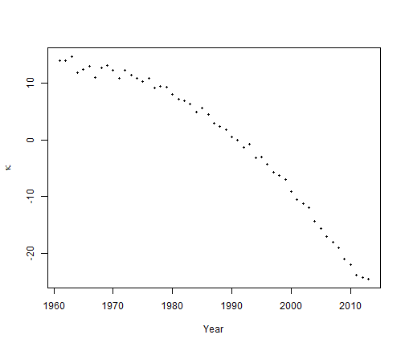

可以看出，$\kappa_y$在每年下降，而刚才式中的$\mu$就代表了这个下降，被称为**漂移参数**（drift
parameter）。误差项$\epsilon_y$服从$Normal(0,\sigma^2)$，在文献中通常被叫做innovations。现在目标就是估计$\mu$和$\sigma^2$。只需要做一次差分，就可以把这个模型估计出来：


$$
\begin{aligned}
\Delta \kappa_y & =\kappa_y-\kappa_{y-1}, y=2, \ldots, n_y \\
& =\mu+\epsilon_y
\end{aligned}
$$


只需要找到差分项的样本均值和样本方差，估计出来的就是$\mu$和$\sigma^2$：


$$
\hat{\mu}=\frac{\sum_2^{n_y} \Delta \kappa_y}{n_y-1}=\frac{\kappa_{n_y}-\kappa_1}{n_y-1} \\
\hat{\sigma}^2=\frac{\sum_2^{n_y}\left(\Delta \kappa_y-\hat{\mu}\right)^2}{n_y-2}
$$


但是，带漂移项和一阶滞后项的随机游走其实是个很简单的模型，我们有可能得到了一个预测效果很差的模型，在这种情况下，学者们对于模型进行了以下的改进：

1.  带漂移项和高阶滞后项的随机游走：
 
$$
\kappa_y=\mu+2 \kappa_{y-1}-\kappa_{y-2}+\epsilon_y, y=3, \ldots, n_y .
$$

模型中的最高阶滞后项的滞后阶数是多少，我们就对它差分多少次，肯定能估计出$\mu$和$\sigma^2$：


$$
\begin{aligned}
\Delta \kappa_y & =\kappa_y-\kappa_{y-1}, y=2, \ldots, n_y, \\
& =\mu+\epsilon_y .
\end{aligned}
$$


2.  自回归模型（AR）

刚才在带漂移项和高阶滞后项的随机游走中，高阶滞后项的系数是确定的，但是我们也可以通过回归来得出这个系数：

$$
    \kappa_y=\mu+ \mathrm{ar}_1 \kappa_{y-1}+\epsilon_y, y=2, \ldots, n_y .
$$

$\mathrm{ar}_1$其实就是个系数，要通过时间序列回归才可以得出来。这样的模型被称为自回归模型。

3.  滑动平均模型（MA） 我们也可以把高阶滞后误差项加入模型：

$$
\kappa_y=\mu+m_1 \epsilon_{y-1}+\epsilon_y, y=2, \ldots, n_y
$$

$m_1$也只是个系数，这样的模型被称为滑动平均模型。

4.  更加复杂的模型
    我们也可以把$\kappa$的高阶滞后项与高阶滞后误差项同时加入模型，变成ARMA模型：

$$
\kappa_y=\mu+\text{ar}_1 \kappa_{y-1}+\text{ar}_2 \kappa_{y-2}+\mathrm{ma}_1 \epsilon_{y-1}+\epsilon_y, y=3, \ldots, n_y
$$


要是一个模型差分$d$次变为ARMA(p,q)模型，我们就称这是一个ARIMA(p,d,q)模型，其中，$p$和$q$分别代表了模型中$\kappa$的最高阶数和误差项的最高阶数。至于要差分多少次，时间序列分析这门课提供了单位根检验这种方法，这里就不再阐述。

下面，我们直接用`astsa`包中的`sarima`函数对下面的最简单的方程进行估计：

$$
\kappa_y=\mu+\kappa_{y-1}+\epsilon_y, y=2, \ldots, n_y
$$


```r
n.y <-  length(Kappa.hat)
# 使用一阶差分法进行参数估计
Mu <- mean(diff(Kappa.hat))
Sigma2 <- var(diff(Kappa.hat)) # var的分母是ny-2
# 使用sarima函数（时间序列回归）进行估计
Sarima.out <- sarima(Kappa.hat, p=0, d=1, q=0, details = FALSE)
# 看看一阶差分法和时间序列回归有什么不同
c(Mu, Sarima.out$fit$coef)
```

```
##              constant 
## -0.7421723 -0.7421723
```

```r
c((n.y-2)/(n.y-1)*Sigma2, Sarima.out$fit$sigma2)
```

```
## [1] 0.941579 0.941579
```

因此，这两种方法在带一阶滞后项与漂移项的随机游走过程参数估计中是相同的。但是，`astsa`包好就好在，它可以使用`sarima.for`函数对未来进行预测，还能出个图片。所以我们之后都用`sarima.for`这个函数：


```r
# 往前预测25年
N.Ahead <-  25
# 拟合一个差分1次的模型，没有p和q
# gg=True表示用ggplot2画图
Kappa.for <-  sarima.for(Kappa.hat, n.ahead = N.Ahead, gg=TRUE, p=0, d=1, q=0)
```

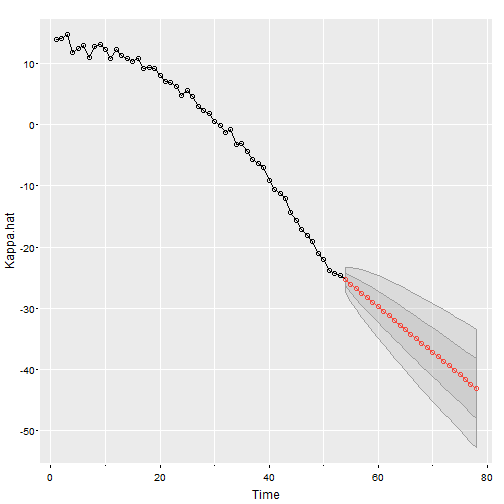

$\kappa$的预测值得出来了，接下来要得到死亡率的预测值，使用双侧5%的置信区间，可以预测死亡率：


```r
Central <-  Kappa.for$pred
SE.Pred <- Kappa.for$se
Z <- qnorm(0.975)
Kappa.Up.Pred <- Central + Z*SE.Pred
Kappa.Dn.Pred <- Central - Z*SE.Pred
Forecast <- Alpha.hat + Beta.hat %*% t(Central)
Forecast.Up.Pred <- Alpha.hat + Beta.hat %*% t(Kappa.Up.Pred)
Forecast.Dn.Pred <- Alpha.hat + Beta.hat %*% t(Kappa.Dn.Pred)
Range <- 2014:2038
```

画出死亡率的图来（这里使用65岁作为例子画个二维图，因为Lee-Carter是个二维修匀模型，正确展示所有预测需要画一个曲面）：


```r
Plot.Age = 65
Plot.Row = Plot.Age - min(AGE) + 1
par(mfrow = c(1,1))
par(mar=c(4.2, 4, 1, 0.5), mgp=c(3, 1, 0), las=1, cex=1)
Year.For = seq(YEAR[1], (YEAR[length(YEAR)]+25))
plot(YEAR + 0.5, Obs[Plot.Row, ], axes = FALSE, xlab = "Year", ylab = "log(mortality)",
     xlim = c(1961, 2040),
     ylim = c(min(Forecast.Dn.Pred[Plot.Row, ]), max(Obs[Plot.Row, ]) ))
axis(1,las = 1, at = seq(1950, 2040, by = 10), tcl = -0.4)
axis(2, seq(-6,-2, by = 0.5), tcl = -0.4)
lines(Range + 0.5, Forecast[Plot.Row, ], lwd = 2)
lines(Range + 0.5, Forecast.Up.Pred[Plot.Row, ], lty = 2, lwd = 2)
lines(Range + 0.5, Forecast.Dn.Pred[Plot.Row, ], lty = 2, lwd = 2)
legend("bottomleft", legend = c("Observed", "Central forecast", "95% PI"),
       lty = c(-1, 1, 2, 2), pch = c(1,-1,-1,-1), lwd = 2, bty = "n") 
```

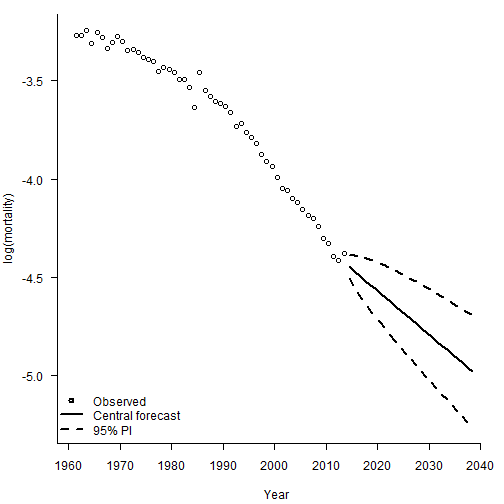

看出来，这个最简单的模型预测的死亡率随年份的变化简直就是一条直线，忽视了死亡率改善曲线的曲率。所以我们一定要慎重地选择死亡率预测的模型。下面的图片列示了各种风险：


在死亡率预测中，很重要的一种风险就是模型风险。如果使用的死亡率预测模型本身都是错误的，那我们就白忙活了。下面的图显示，不同参数下的ARIMA模型得出的预测结果差别比较大，一定要审慎选择模型。


```r
Plot.Age <-  65
Plot.Row <-  Plot.Age - min(AGE) + 1
par(mar=c(4.2, 4, 1, 0.5), mgp=c(3, 1, 0), las=1, cex=1)
Year.For <-  seq(YEAR[1], (YEAR[length(YEAR)]+25))
plot(YEAR + 0.5, Obs[Plot.Row, ], axes = FALSE, xlab = "Year", ylab = "log(mortality)",
     xlim = c(1961, 2040),
     ylim = c(min(Forecast.Dn.Pred[Plot.Row, ]), max(Obs[Plot.Row, ]) ))
axis(1,las = 1, at = seq(1950, 2040, by = 10), tcl = -0.4)
axis(2, seq(-6,-2, by = 0.5), tcl = -0.4)
lines(Range + 0.5, Forecast[Plot.Row, ], lty = 1, lwd = 2)

par(new = TRUE)
Kappa.for <-  sarima.for(Kappa.hat, plot = FALSE, n.ahead = N.Ahead, p=3, d=1, q=1)
Central1 <-  Kappa.for$pred
Forecast1 <-  Alpha.hat + Beta.hat %*% t(Central1)
lines(Range + 0.5, Forecast1[Plot.Row, ], lty = 2)

par(new = TRUE)
Kappa.for <-  sarima.for(Kappa.hat, plot = FALSE, n.ahead = N.Ahead, p=6, d=1, q=0)
Central2 <-  Kappa.for$pred
Forecast2 <-  Alpha.hat + Beta.hat %*% t(Central2)
lines(Range + 0.5, Forecast2[Plot.Row, ], lty = 3)

legend("bottomleft", legend = c("Observed", "p = 0, d = 1, q = 0", "p = 3, d = 1, q = 1", "p = 6, d = 1, q = 0"), lty = c(-1, 1, 2, 3), pch = c(1,-1,-1,-1), lwd = c(-1,2,1,1)) 
```

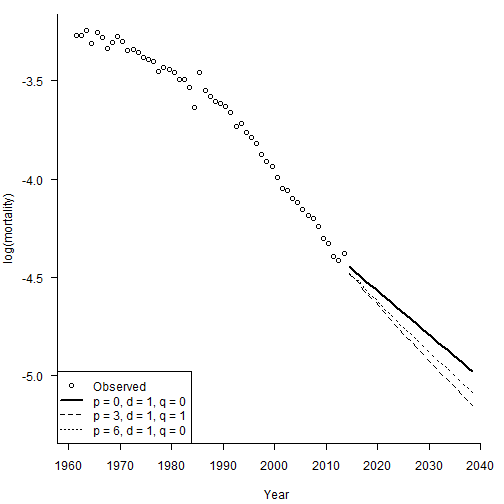

## 2.3 情景生成和偏差分解

“偿二代”的存在要求人们生成一定的经济情景。刚才的模型中还存在$\epsilon_y$，之前一直假设其为0。现在我们把随机误差项加进来，做100个样本轨道，生成情景：


```r
# N.Sim
N.Ahead <- 25; Range <-  2014:2038; N.Sim <- 100
# 生成一堆随机数，代表\epsilon的实现值
Mat.Sim <-  matrix(rnorm(N.Sim * N.Ahead, Mu, sqrt(Sigma2)),nrow = N.Sim, ncol = N.Ahead)
# 使用apply函数，把\epsilon加上去
Stoch <-  Kappa.hat[n.y] + apply(Mat.Sim, 1, cumsum)
# 绘制样本轨道
matplot(Range, Stoch, type = "l", col = 1)
axis(1, las = 1, at = seq(2010, 2040, by = 5), tcl = -0.4)
axis(2, seq(-70, -10, by = 5), tcl = -0.4)
```

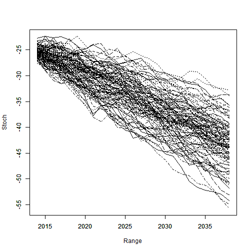

通过大量生成的样本轨道，我们就可以求出在每个时间点上预测$\kappa$的分位数。样本轨道的分位数和我们使用理论预测的分位数是否相同？下面这张图说明了这个事情：


```r
N.Ahead <- 25
Forecast <- sarima.for(Kappa.hat, n.ahead = N.Ahead, plot = FALSE, p=0, d=1, q=0)
set.seed(2120223132)
# 生成1000条样本轨道
N.Sim <- 1000
Mat.Sim <- matrix(rnorm(N.Sim * N.Ahead, Mu, sqrt(Sigma2)), nrow = N.Sim, ncol = N.Ahead)
# 逐步加起来，得到样本轨道
Stoc <- Kappa.hat[n.y] + apply(Mat.Sim, 1, cumsum)
# 找到每个时间点上的2.5%、50%和97.5%分位点
Quantile <- function(x) quantile(x, c(0.025, 0.5, 0.975))
Sim.Q <- apply(Stoc, 1, Quantile)
par(mar=c(4.2, 4, 1, 0.5), mgp=c(3, 1, 0), las=1, cex=1)
plot(Range, Sim.Q[2, ], type = "l", lwd = 2, axes = FALSE,
     xlab = "Year", ylab = expression(kappa), ylim = range(Sim.Q, Sim.Q))
axis(1, las = 1, at = seq(2010, 2040, by = 5), tcl = -0.4)
axis(2, seq(-70, -10, by = 5), tcl = -0.4)
lines(Range, Sim.Q[1, ], lwd = 2)
lines(Range, Sim.Q[3, ], lwd = 2)

# 理论标准误
Central <- Forecast$pred
SE.Stoch <- Forecast$se
PI.Up <- Central + 1.96*SE.Stoch
PI.Dn <- Central - 1.96*SE.Stoch
lines(Range, Central, lwd = 2, lty = 2)
lines(Range, PI.Up, lwd = 2, lty = 2)
lines(Range, PI.Dn, lwd = 2, lty = 2)
legend("bottomleft", legend = c("95% PI: theoretical", "95% PI: simulated"),
       lty = c(2,1), lwd = 2, bty = "n")
```

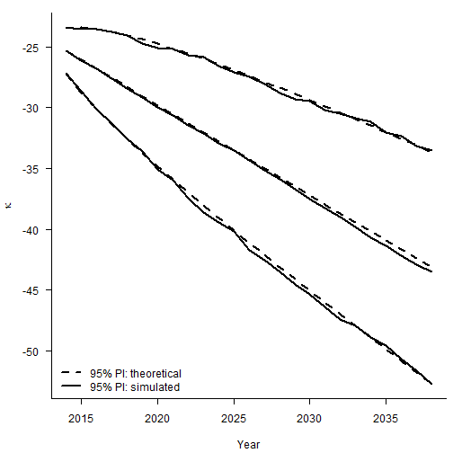

整体来看，各个分类点的距离也比较相近。但是需要注意，上面的图形只考虑到了stochastic error（随机误差项带来的后续波动），没有考虑到parameter error（估计量$\hat{\mu}$本身的方差）。


```r
set.seed(1)
N.Sim <-  50
Mat.Sim <-  matrix(rep(rnorm(N.Sim, Mu, sqrt(Sigma2)/sqrt(n.y-1)), N.Ahead),
  nrow = N.Sim, ncol = N.Ahead)
Param <-  Kappa.hat[n.y] + apply(Mat.Sim, 1, cumsum)
par(mar=c(4.2, 4, 1, 0.5), mgp=c(3, 1, 0), las=1, cex=1)
matplot(Range, Param, type = "l", col = 1, xlab = "Year",
        ylab = expression(kappa), axes = FALSE)
axis(1, las = 1, at = seq(2010, 2040, by = 5), tcl = -0.4)
axis(2, seq(-70, -10, by = 5), tcl = -0.4)
```

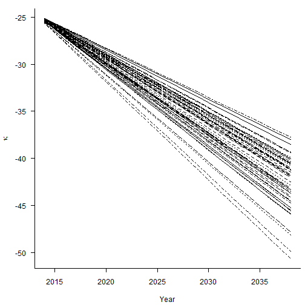

```r
#
set.seed(1)
N.Sim <-  5000
Mat.Sim <-  matrix(rep(rnorm(N.Sim, Mu, sqrt(Sigma2)/sqrt(n.y-1)), N.Ahead),
  nrow = N.Sim, ncol = N.Ahead)
Param <-  Kappa.hat[n.y] + apply(Mat.Sim, 1, cumsum)
Sim.Q.Param <- apply(Param, 1, Quantile)
par(mar=c(4.2, 4, 1, 0.5), mgp=c(3, 1, 0), las=1, cex=1)
plot(Range, Sim.Q.Param[2, ], type = "l", lwd = 2, axes = FALSE,
     xlab = "Year", ylab = expression(kappa),
     ylim = range(Sim.Q.Param, Sim.Q.Param))
axis(1, las = 1, at = seq(2010, 2040, by = 5), tcl = -0.4)
axis(2, seq(-70, -10, by = 5), tcl = -0.4)
lines(Range, Sim.Q.Param[1, ], lwd = 2)
lines(Range, Sim.Q.Param[3, ], lwd = 2)
#
lines(Range, Central, lwd = 2, lty = 2)
SE <-  (1:N.Ahead) * sqrt(Sarima.out$fit$sigma2/(n.y-1))
CI.Up <-  Central + 1.96*SE
CI.Dn <-  Central - 1.96*SE
lines(Range, CI.Up, lty = 2, lwd = 2)
lines(Range, CI.Dn, lty = 2, lwd = 2)
legend("bottomleft", legend = c("95% CI: theoretical", "95% CI: simulated"),
       lty = c(2,1), lwd = 2, bty = "n")
```


总之，对于任意的$\hat{\kappa}_{n_y+m}$，我们有：

$$
\begin{aligned}
\operatorname{Var}\left(\hat{\kappa}_{n_y+m}\right) & =\operatorname{Var}\left(m \hat{\mu}+\sum_{j=1}^m \epsilon_{n_y+j}\right) \\
& =m^2 \operatorname{Var}(\hat{\mu})+\operatorname{Var}\left(\sum_{j=1}^m \epsilon_{n_y+j}\right) \\
& =m^2 \frac{\sigma^2}{n_y-1}+m \sigma^2
\end{aligned}
$$

两种error加在一起，才是最终的标准误。


```r
set.seed(2120223132)
N.Sim = 100
#   
#    We simulate the stochastic error with mean zero
#    and then add the simulated values of mu
#
Mat.Sim.1 = matrix(rnorm(N.Sim * N.Ahead, 0, sqrt(Sigma2)),
  nrow = N.Sim, ncol = N.Ahead)
Mat.Sim.2 = matrix(rep(rnorm(N.Sim, Mu, sqrt(Sigma2)/sqrt(n.y-1)), N.Ahead),
  nrow = N.Sim, ncol = N.Ahead)
Mat.Sim = Mat.Sim.1 + Mat.Sim.2
Both = Kappa.hat[n.y] + apply(Mat.Sim, 1, cumsum)
# 
par(mar=c(4.2, 4, 1, 0.5), mgp=c(3, 1, 0), las=1, cex=1)
matplot(Range, Both, type = "l", col = 1, xlab = "Year",
        ylab = expression(kappa), axes = FALSE)
axis(1, las = 1, at = seq(2010, 2040, by = 5), tcl = -0.4)
axis(2, seq(-70, -10, by = 5), tcl = -0.4)
```

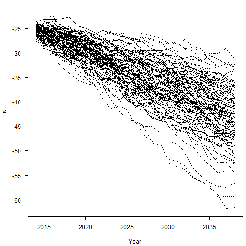

```r
#
set.seed(2120223132)
N.Sim = 1000
Mat.Sim.1 = matrix(rnorm(N.Sim * N.Ahead, 0, sqrt(Sigma2)),
  nrow = N.Sim, ncol = N.Ahead)
Mat.Sim.2 = matrix(rep(rnorm(N.Sim, Mu, sqrt(Sigma2)/sqrt(n.y-1)), N.Ahead),
  nrow = N.Sim, ncol = N.Ahead)
Mat.Sim = Mat.Sim.1 + Mat.Sim.2
Both = Kappa.hat[n.y] + apply(Mat.Sim, 1, cumsum)
Sim.Q.Both = apply(Both, 1, Quantile)
# 
par(mar=c(4.2, 4, 1, 0.5), mgp=c(3, 1, 0), las=1, cex=1)
plot(Range, Sim.Q.Both[2, ], type = "l", lwd = 2, axes = FALSE,
     xlab = "Year", ylab = expression(kappa),
     ylim = range(Sim.Q.Both, Sim.Q.Both))
axis(1, las = 1, at = seq(2010, 2040, by = 5), tcl = -0.4)
axis(2, seq(-70, -10, by = 5), tcl = -0.4)
lines(Range, Sim.Q.Both[1, ], lwd = 2)
lines(Range, Sim.Q.Both[3, ], lwd = 2)
#
lines(Range, Central, lwd = 2, lty = 2)
VAR1 = (1:N.Ahead) * Sigma2
VAR2  = (1:N.Ahead)^2/(n.y-1) * Sigma2
SE.Both = sqrt(VAR1 + VAR2)
PI.CI.Up = Central + 1.96*SE.Both
PI.CI.Dn = Central - 1.96*SE.Both
lines(Range, PI.CI.Up, lty = 2, lwd = 2)
lines(Range, PI.CI.Dn, lty = 2, lwd = 2)
legend("bottomleft", legend = c("95%: theoretical", "95%: simulated"),
       lty = c(2,1), lwd = 2, bty = "n")
```


# 3. 使用Pspline预测未来死亡率（一维预测）

如前面课程所述，Pspline是一个带惩罚项的方法。因为这里只是一个一维预测，所以我们需要重读一遍死亡率，用美国1961-2009年70岁女性的数据：


```r
# 直接从数据中拿到US1961-2009年70岁女性的死亡数和暴露数
Death.Data <- Read.HMD("C:\\Users\\lenovo\\Desktop\\lt\\HMD_USA_Deaths.txt")
Exposure.Data <- Read.HMD("C:\\Users\\lenovo\\Desktop\\lt\\HMD_USA_Exposures.txt")
Age <- Death.Data$Age
Year <- Death.Data$Year
# 拿到1961-2009年的70岁女性数据
YEAR <- 1961:2009 
Dth <- Death.Data$Female.Matrix[Age == 70, (Year > 1960) & (Year < 2010)]
Exp <- Exposure.Data$Female.Matrix[Age == 70, (Year > 1960) &
  (Year < 2010)]
Obs <- log(Dth/Exp)
```

在Pspline方法中，拟合与预测可以同时发生。怎么做呢？
- 把年份加以扩充，要预测多少年就加多少年上去，生成变量`YEAR.NEW`；
- 在`Mort1Dsmooth`函数中设置权重，预测年的权重为0，历史年的权重为1，表明仅用历史拟合；
- 预测年的死亡数设置为1（其实可以设置为任何数）；
- 预测年的暴露数设置为2（和死亡数一样，可以设置为任何数）；
- 使用过度分散。


```r
# 预测年的权重为0，历史年的权重为1
Weight <- c(rep(1, length(YEAR)), rep(0,25))
# 年份扩充
YEAR.NEW <- YEAR[1]:(YEAR[length(YEAR)] + 25)
# 预测年的死亡数设置为1
Dth.NEW <- c(Dth, rep(1, 25))
# 预测年的暴露数设置为2
Exp.NEW <- c(Exp, rep(2, 25))
# 过度分散
Smooth.Forecast <- Mort1Dsmooth(x = YEAR.NEW, y = Dth.NEW, offset = log(Exp.NEW),
  w = Weight, over = TRUE)
```

```
## Warning: Interpolation and/or extrapolation is taking place
```

让我们来看看结果：这个模型本质上就相当于回归系数的线性外推：


```r
Range <- max(YEAR.NEW) - min(YEAR.NEW)
# 问题出在floor(length(x)/5)这里，将整体补上range/5做一个近似
Xmax <- max(YEAR.NEW) + 0.01 * Range   #  Technical: look at Mort1Dsmooth code
Xmin <- min(YEAR.NEW) - 0.01 * Range
ndx <- Smooth.Forecast$ndx
Delta <- (Xmax - Xmin)/ndx
Knots <- seq(Xmin, Xmax, by = Delta)
Coef <- Smooth.Forecast$coef
# 验证线性外推，做一阶差分
cbind(c(0,Knots,0), Coef, c(0, diff(Coef)))
```

```
##                     Coef            
##  [1,]    0.000 -3.496457  0.00000000
##  [2,] 1960.270 -3.528606 -0.03214908
##  [3,] 1965.589 -3.569153 -0.04054709
##  [4,] 1970.907 -3.603589 -0.03443595
##  [5,] 1976.226 -3.728126 -0.12453715
##  [6,] 1981.544 -3.827552 -0.09942625
##  [7,] 1986.863 -3.850877 -0.02332484
##  [8,] 1992.181 -3.898453 -0.04757661
##  [9,] 1997.500 -3.921005 -0.02255162
## [10,] 2002.819 -3.973485 -0.05247998
## [11,] 2008.137 -4.102135 -0.12864956
## [12,] 2013.456 -4.235561 -0.13342600
## [13,] 2018.774 -4.368989 -0.13342846
## [14,] 2024.093 -4.502418 -0.13342846
## [15,] 2029.411 -4.635846 -0.13342846
## [16,] 2034.730 -4.769274 -0.13342846
## [17,]    0.000 -4.902703 -0.13342846
```

```r
par(mar=c(4.2, 4, 0, 0.5), mgp=c(3, 1, 0), las=1, cex=1)
plot(YEAR, Obs, xlab = "Year", xlim = c(1960, 2035), ylim = c(-4.8, -3.5),
     ylab = "log(mortality)", axes = FALSE)
axis(1,las = 1, at = seq(1950, 2040, by = 10), tcl = -0.4)
axis(2, seq(-5.2,-3.5, by = 0.1), tcl = -0.4)
lines(YEAR.NEW, Smooth.Forecast$logm, lwd = 2)
points(Knots, Coef[2:(length(Coef)-1)], pch = 15)
legend(1960, -4.2, legend = c("Observed mortality", "P-spline regression",
                            "P-spline coefficients"),
       lty = c(-1, 1, -1), lwd = c(-1, 2, -1),
       pch = c(1, -1, 15), bty = "n")
```

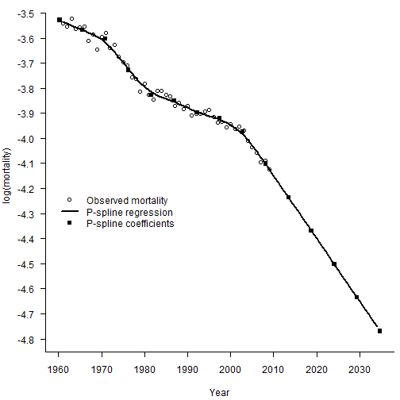

下面，我们简单说一下为什么这样做会自然地做线性外推。首先，优化的目标函数是：

$$
\ell_p(\boldsymbol{\theta})=\ell(\boldsymbol{\theta})-\frac{1}{2} \lambda P(\boldsymbol{\theta})
$$

我们让预测年的权重为0，所以预测年的加入不会影响似然函数$\ell(\boldsymbol{\theta})$。现在我们假设已经得到了拟合年的系数预测$\boldsymbol{\theta} = (\theta_1, \cdots,\theta_c)^{\prime}$，现在看加入第一个预测年的系数是多少时，能够让惩罚项$P(\boldsymbol{\theta})$继续保持最小。一般来说，为了保障光滑程度，惩罚项与系数的二次差分正相关。这时，只要让二次差分最小（也即是为0），即可保证惩罚项的最小。


$$
\left(\hat{\theta}_{c-1}-2 \hat{\theta}_c+\theta_{c+1}\right)^2=0 \\
\theta_{c+1} = 2 \hat{\theta}_c - \hat{\theta}_{c-1}
$$


所以系数在做线性外推，参照是拟合年的最后两个系数。刚才的推导其实有点复杂，但是我们可以轻易地使用`predict()`进行预测：


```r
Smooth.Fit <- Mort1Dsmooth(x = YEAR, y = Dth, offset = log(Exp), over = TRUE)
# 进行预测
# 惩罚项基于二阶差分（default）
Smooth.Forecast <- predict(Smooth.Fit, newdata = YEAR.NEW, se.fit = TRUE)
par(mar=c(4.2, 4, 0, 0.5), mgp=c(3, 1, 0), las=1, cex=1)
plot(YEAR, Obs, xlab = "Year", xlim = c(1960, 2035), ylim = c(-4.9, -3.4),
     ylab = "log(mortality)", axes = FALSE)
axis(1,las = 1, at = seq(1950, 2040, by = 10), tcl = -0.4)
axis(2, seq(-5.0,-3.4, by = 0.2), tcl = -0.4)
lines(YEAR.NEW, Smooth.Forecast$fit, lwd = 2)
lines(YEAR.NEW, Smooth.Forecast$fit + 1.96 * Smooth.Forecast$se.fit,
      lty = 2, lwd = 2)
lines(YEAR.NEW, Smooth.Forecast$fit - 1.96 * Smooth.Forecast$se.fit,
      lty = 2, lwd = 2)
legend(1960, -4.2, legend = c("Observed mortality", "Fit and forecast",
                            "95% CI"),
       lty = c(-1, 1, 2), lwd = c(-1, 2, 2),
       pch = c(1, -1, -1), bty = "n")
```

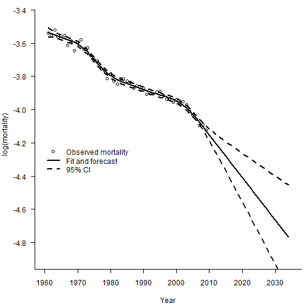

使用不同阶数的差分，对于预测的结果影响非常大。如果使用一阶差分，那么预测期的死亡率将会被固定为常数。


```r
# 进行预测
# 惩罚项基于一阶差分（default）
Smooth.Fit1 <-  Mort1Dsmooth(x = YEAR, y = Dth, offset = log(Exp),pord = 1,over = TRUE)
Smooth.Forecast1 <-  predict(Smooth.Fit1, newdata = YEAR.NEW, pord = 1, se.fit = TRUE)
par(mar=c(4.2, 4, 0, 0.5), mgp=c(3, 1, 0), las=1, cex=1)
plot(YEAR, Obs, xlab = "Year", xlim = c(1960, 2035), ylim = c(-4.9, -3.4),
     ylab = "log(mortality)", axes = FALSE)
axis(1,las = 1, at = seq(1950, 2040, by = 10), tcl = -0.4)
axis(2, seq(-5.0,-3.4, by = 0.2), tcl = -0.4)
lines(YEAR.NEW, Smooth.Forecast1$fit, lty = 1)
# 惩罚项基于二阶差分
Smooth.Fit2 <-  Mort1Dsmooth(x = YEAR, y = Dth, offset = log(Exp),pord = 2,over = TRUE)
Smooth.Forecast2 <-  predict(Smooth.Fit2, newdata = YEAR.NEW, se.fit = TRUE)
lines(YEAR.NEW, Smooth.Forecast2$fit, lty = 2)
# 惩罚项基于三阶差分
Smooth.Fit3 <-  Mort1Dsmooth(x = YEAR, y = Dth, offset = log(Exp),pord = 3,over = TRUE)
Smooth.Forecast3 <-  predict(Smooth.Fit3, newdata = YEAR.NEW, pord = 3, se.fit = TRUE)
lines(YEAR.NEW, Smooth.Forecast3$fit, lty = 3)

legend("bottomleft", legend = c("order of penalty = 1", "order of penalty = 2",
                            "order of penalty = 3"),
       lty = c(1, 2, 3), bty = "n")
```

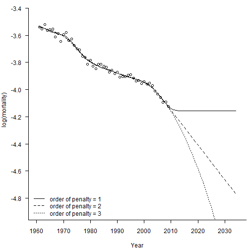

可以看出，三阶差分就已经能得到很好的效果了，能够得出一个弯曲的死亡率曲线。

# 4. CBD模型预测
令$\kappa_y=\left(\kappa_y^{(1)}, \kappa_y^{(2)}\right)^{\prime}$，则可以假设两个$\kappa$满足二维的带漂移项随机游走：

$$
\boldsymbol{\kappa}_y=\boldsymbol{\mu}+\boldsymbol{\kappa}_{y-1}+\boldsymbol{\epsilon}_y, y=2, \ldots, n_y
$$

差分一次就能得到估计，只不过是用矩阵表示了而已。中间的很多表示都能使用Cronecker积直接进行表示，这里就不赘述了。

首先读入数据：


```r
Death.Data <-  Read.HMD("C:\\Users\\lenovo\\Desktop\\lt\\leecarter\\Lee-Carter Application\\HMD_UK_Deaths_2013.txt")
Exposure.Data <-  Read.HMD("C:\\Users\\lenovo\\Desktop\\lt\\leecarter\\Lee-Carter Application\\HMD_UK_Exposures_2013.txt")
# 年龄和年份，一个是所有年龄，一个是目标年龄
Age <-  Death.Data$Age
Year <-  Death.Data$Year
AGE <-  50:90
YEAR <-  1961:2013
# 1961-2013年，英国50-90岁男性
Dth <-  Death.Data$Male.Matrix[(49 < Age) & (Age < 91),
(1960 < Year) & (Year < 2014)]
Exp <-  Exposure.Data$Male.Matrix[(49 < Age) & (Age < 91),
(1960 < Year) & (Year < 2014)]
# Obs是中心死亡率取对数
Obs <-  log(Dth/Exp)
# 取得死亡率矩阵的维度
n.x <-  nrow(Dth)
n.y <-  ncol(Dth)
```

接着做一个Poission glm：


```r
#    Convert data to vector form
Dth.V <- c(Dth); 
Exp.V  <-  c(Exp)
#    Obtain model matrix for CBD model
X1 <- kronecker(diag(n.y), rep(1, n.x))
Age.mean <- AGE - mean(AGE)
X2 <- kronecker(diag(n.y), Age.mean)
X <- cbind(X1, X2)
#    Fit model
CBD.Male <- glm(Dth.V ~ -1 + X, offset = log(Exp.V), family = poisson)
Coef <- CBD.Male$coef
Kappa.1 <- Coef[1:n.y]     #  First n.y values
Kappa.2 <- Coef[-(1:n.y)]  #  Drop first n.y values
CBD.Male$dev    # Deviance
```

```
## [1] 39251.92
```

```r
#    Fitted log(mortality) from (a) fitted deaths (b) X kappa
Fitted.M.hat <- matrix(log(CBD.Male$fit/Exp.V), n.x, n.y)
Fitted.M.Hat <- matrix(X %*% CBD.Male$coef, n.x, n.y)
max(abs(Fitted.M.hat - Fitted.M.Hat))   #  Equal of course
```

```
## [1] 1.776357e-15
```

随后就可以对参数做出估计：


```r
# 二阶差分后均值可以求出\hat{\mu}
Diff = cbind(diff(Kappa.1), diff(Kappa.2))
Mu = apply(Diff, 2, mean)
# 也可以按照书上公式进行计算
Mu.2 = c(Kappa.1[n.y] - Kappa.1[1], Kappa.2[n.y] - Kappa.2[1])/(n.y-1)
max(abs(Mu - Mu.2))
```

```
## [1] 0
```

```r
# 使用样本协方差矩阵求得\hat{\sigma}
S2 = apply(Diff, 2, var)
Cov = cov(Diff[ ,1], Diff[ ,2])
Sigma = matrix(c(S2[1], Cov, Cov, S2[2]), 2, 2)
Rho = Cov/sqrt(Sigma[1,1]*Sigma[2,2])
# 也可以直接套公式
Sigma.2 = matrix(0, 2, 2)
Sigma.2[1, 1] = sum((diff(Kappa.1) - Mu[1])^2)/(n.y - 2)
Sigma.2[2, 1] = sum((diff(Kappa.1) - Mu[1])*(diff(Kappa.2) -
         Mu[2]))/(n.y - 2)
Sigma.2[1, 2] = Sigma.2[2, 1]
Sigma.2[2, 2] = sum((diff(Kappa.2) - Mu[2])^2)/(n.y - 2)
max(abs(Sigma - Sigma.2))
```

```
## [1] 1.084202e-19
```

最后，就可以用kronecker积形式的CBD模型对未来做出预测：


```r
#     Forecasting - follows text closely
#
n.f = 25
I.f = diag(n.f)
X1.f = kronecker(I.f, rep(1, n.x))
X2.f = kronecker(I.f, Age.mean)
X.f = cbind(X1.f, X2.f)
c.f = 1:n.f
Kappa.f = c(Kappa.1[n.y], Kappa.2[n.y]) + Mu %*% t(c.f)
Kappa.f = c(t(Kappa.f))
Forecast = X.f %*% Kappa.f
dim(Forecast) = c(n.x, n.f)
Var.Mat.Forecast = 1/(n.y -1) * X.f %*% kronecker(Sigma, c.f %*% t(c.f)) %*% t(X.f)
Var.Forecast = diag(Var.Mat.Forecast)
dim(Var.Forecast) = c(n.x, n.f)
SD.Forecast = sqrt(Var.Forecast)
SD.Forecast.CBD = SD.Forecast
# \kappa_1预测
Forecast.Years = (YEAR[n.y]+1):(YEAR[n.y]+n.f)
par(mfrow = c(2,2), mar = c(4.5,4.5,1,1))
plot(YEAR, Kappa.1, xlab = "Year", ylab = expression(kappa[1]),
     xlim = range(YEAR, Forecast.Years), ylim = range(Kappa.1,Kappa.f[1:n.f]),
     cex = 1)
lines(Forecast.Years, Kappa.f[1:n.f], pch = 16, cex = 1)
# \kappa_2预测
plot(YEAR, Kappa.2, xlab = "Year", ylab = expression(kappa[2]),
     xlim = range(YEAR, Forecast.Years), ylim = range(Kappa.2,Kappa.f[-(1:n.f)]),
     cex = 1)
lines(Forecast.Years, Kappa.f[-(1:n.f)], pch = 16, cex = 1)
# 选60和80岁分别看死亡率的预测
Plot.Age = c(60, 80)
for(i in 1:2){
  Plot.Row = Plot.Age[i] - min(AGE) + 1
  plot(YEAR + 0.5, Obs[Plot.Row, ], xlim = c(YEAR[1], YEAR[n.y] + n.f),
       ylim = range(Obs[Plot.Row, ], Forecast[Plot.Row, ]),
       xlab = "Year", ylab = expression(paste("log(",mu,")")))
  SD = SD.Forecast[Plot.Row, ]
  lines(Forecast.Years + 0.5, Forecast[Plot.Row, ])
  lines(Forecast.Years + 0.5, Forecast[Plot.Row, ] + 1.96 * SD)
  lines(Forecast.Years + 0.5, Forecast[Plot.Row, ] - 1.96 * SD)
  legend("bottomleft", legend = paste("Age =", Plot.Age[i]), bty = "n")
}
```

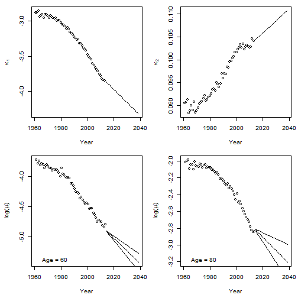

# 5. 2D Pspline预测


```r
#      Forecasting
#
Fit.2d = Mort2Dsmooth(AGE, YEAR, Dth, offset=log(Exp), over = TRUE)
c(Fit.2d$lambda, Fit.2d$df, Fit.2d$dev, Fit.2d$psi2)
```

```
## [1]  1000.00000   316.22777    44.94686 10311.56693     4.84554
```

```r
YEAR.NEW = 1961:2038
NEW.DATA = list(x = AGE, y = YEAR.NEW)
Forecast.2d = predict(Fit.2d, newdata = NEW.DATA)
Central = Forecast.2d
# 
par(mfrow = c(2,2), mar = c(4.5,4.5,1,1))
Age.Plot = c(60,75,90)  # Set plotting age
for(i in 1:3){
  Row = Age.Plot[i] - min(AGE) + 1
  plot(YEAR+0.5, Obs[Row, ], xlim = range(YEAR.NEW),
                         ylim = range(Obs[Row,], Central[Row,]), xlab = "Year",
       ylab = expression(paste("log(",mu,")")), cex = 0.5, pch = 16)
  lines(YEAR.NEW + 0.5, Central[Row, ])
  legend("bottomleft", paste("Age =", Age.Plot[i]), bty = "n")
}
# 
plot(AGE+0.5, Forecast.2d[ , 53], type = "l", xlab = "Age",
     ylab = expression(paste("log(",mu,")")),
     ylim = range(Forecast.2d[ , 53],  Forecast.2d[ , 78]), lwd = 2)
lines(AGE+0.5, Forecast.2d[ , 78], lty = 2, lwd = 2)
legend("topleft", legend = c("Year = 2013", "Year = 2038"), lty = c(1,2), lwd = 2,
       bty = "n")
```

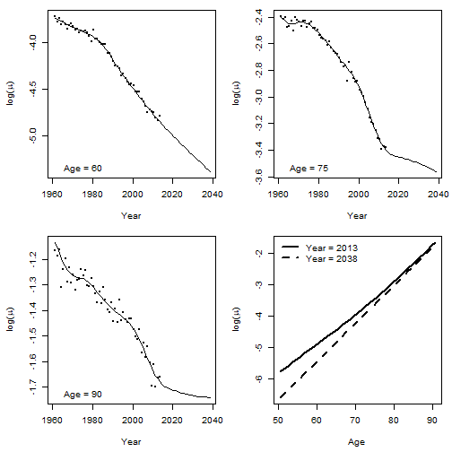


```r
# Now force lambdas
#
Fit.2d = Mort2Dsmooth(AGE, YEAR, Dth, offset=log(Exp),
  method = 3, lambdas = c(2000, 4000))
```

```
## Warning in !lambdas.check && lambdas < 0: 'length(x) = 2 > 1' in coercion to
## 'logical(1)'
```

```r
c(Fit.2d$lambda, Fit.2d$df, Fit.2d$dev,Fit.2d$psi2)
```

```
## [1]  2000.000000  4000.000000    44.710172 10404.096261     4.888477
```

```r
YEAR.NEW = 1961:2038
NEW.DATA = list(x = AGE, y = YEAR.NEW)
Forecast.2d = predict(Fit.2d, newdata = NEW.DATA, se.fit = TRUE)
Forecast.Pspline = Forecast.2d$fit
Central = Forecast.2d$fit; SE = sqrt(Fit.2d$psi2) * Forecast.2d$se.fit
CI.UP = Central + 1.96 * SE; CI.DN = Central - 1.96 * SE
#
#    Graphical output
#
par(mfrow = c(2,2), mar = c(4.5,4.5,1,1))
Age.Plot = c(60,75,90)  # Set plotting age
for(i in 1:3){
  Row = Age.Plot[i] - min(AGE) + 1
  plot(YEAR, Obs[Row, ], xlim = range(YEAR.NEW),
                         ylim = range(Obs[Row,], CI.DN[Row,]), xlab = "Year",
       ylab = expression(paste("log(",mu,")")), cex = 0.5, pch = 16)
  lines(YEAR.NEW, Central[Row, ])
  lines(YEAR.NEW, CI.UP[Row, ], lty = 2)
  lines(YEAR.NEW, CI.DN[Row, ], lty = 2)
  legend("bottomleft", paste("Age =", Age.Plot[i]), bty = "n")
}
# 
plot(AGE, Forecast.2d$fit[ , 53], type = "l", xlab = "Age",
     ylab = expression(paste("log(",mu,")")),
     ylim = range(Forecast.2d$fit[ , 53],  Forecast.2d$fit[ , 78]), lwd = 2)
lines(AGE, Forecast.2d$fit[ , 78], lty = 2, lwd = 2)
legend("topleft", legend = c("Year = 2013", "Year = 2038"), lty = c(1,2), lwd = 2,
       bty = "n")
```

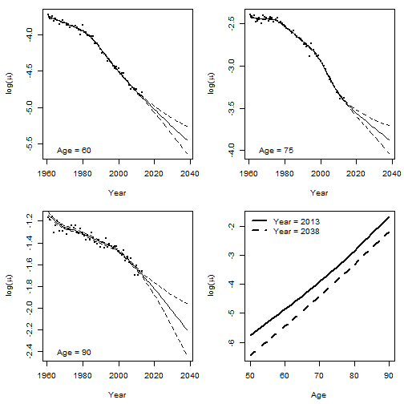